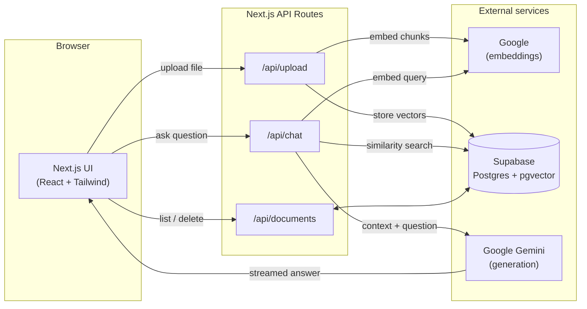
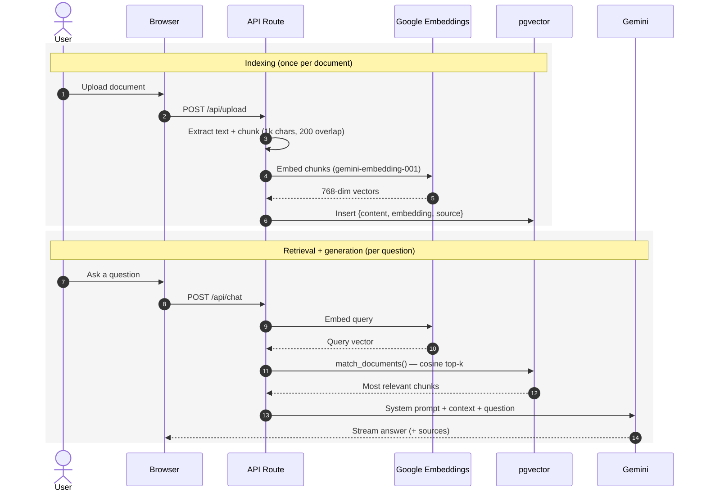

<div align="center">

# Sourced

### Chat with your documents — grounded, cited answers powered by RAG

Upload PDFs or text files and ask questions in natural language. Every answer is
generated **only** from your documents and comes with verifiable source citations —
no hallucinations, no guessing.

[](https://nextjs.org/)
[](https://www.typescriptlang.org/)
[](https://tailwindcss.com/)
[](https://supabase.com/)
[](https://ai.google.dev/)

[**Live demo**](https://your-deployment.vercel.app) · [Features](#features) · [Architecture](#architecture) · [How it works](#how-it-works) · [Getting started](#getting-started)

</div>

---

## Overview

**Sourced** is a full-stack retrieval-augmented generation (RAG) application. Rather
than relying on a language model's memorized knowledge, it retrieves the most
relevant passages from *your* uploaded documents and uses them as the sole context
for each answer — the pattern behind modern "chat with your data" products.

It demonstrates an end-to-end RAG pipeline: document ingestion, text chunking,
vector embeddings, similarity search, and streaming LLM generation with citations.

## Features

| | |
| --- | --- |
| **Document ingestion** | Upload PDF, TXT, or Markdown files; text is extracted, chunked, embedded, and stored as vectors |
| **Grounded answers** | Responses are generated only from retrieved context — the model is instructed to say "I don't know" rather than hallucinate |
| **Inline citations** | Answers cite source filenames; an expandable panel shows each retrieved chunk with its similarity score |
| **Streaming responses** | Tokens stream to the UI in real time over a newline-delimited JSON protocol |
| **Knowledge-base management** | List indexed documents with chunk counts and remove them in one click |
| **Production-ready** | Lazy-initialized clients, batched embeddings, and typed end-to-end |

## Architecture



## How it works

The core RAG algorithm runs in two phases — **indexing** (on upload) and
**retrieval + generation** (on each question).



**Why each piece:**

- **Chunking with overlap** keeps passages that straddle a boundary retrievable.
- **Google embeddings** map text to a 768-dim vector space where semantic
  similarity ≈ geometric closeness, so the most relevant chunks can be found by
  nearest-neighbour search.
- **pgvector cosine search** (`match_documents`) returns the top-k nearest chunks.
- **Gemini** generates the final answer constrained to that retrieved context.

## Tech stack

| Layer | Technology |
| --- | --- |
| Framework | Next.js 16 (App Router) + React 19 |
| Language | TypeScript |
| Styling | Tailwind CSS, Geist typeface |
| Vector store | Supabase (Postgres + `pgvector`) |
| Embeddings | Google `gemini-embedding-001` (768-dim) |
| Generation | Google Gemini (streamed) |
| Hosting | Vercel |

## Getting started

### Prerequisites

- Node.js 18+
- A [Supabase](https://supabase.com) project and a
  [Google AI Studio](https://aistudio.google.com/apikey) API key (generous free
  tiers on both — no credit card required)

### 1. Install

```bash
git clone https://github.com/prem-maradiya/ai-chatbot-for-document.git
cd ai-chatbot-for-document
npm install
```

### 2. Set up the database

In the Supabase dashboard, open **SQL Editor → New query**, paste the contents of
[`supabase/schema.sql`](supabase/schema.sql), and run it. This enables `pgvector`
and creates the `documents` table plus the `match_documents` and `list_documents`
functions.

### 3. Configure environment

```bash
cp .env.local.example .env.local
```

| Variable | Where to find it |
| --- | --- |
| `GOOGLE_API_KEY` | [aistudio.google.com/apikey](https://aistudio.google.com/apikey) |
| `NEXT_PUBLIC_SUPABASE_URL` | Supabase → Project Settings → API |
| `SUPABASE_SERVICE_ROLE_KEY` | Supabase → Project Settings → API |
| `CHAT_MODEL` *(optional)* | Defaults to `gemini-2.5-flash`; set `gemini-2.5-flash-lite` for lower cost/latency |

### 4. Run

```bash
npm run dev
```

Open <http://localhost:3000>, upload a document, and start asking questions.

## Deployment

Deployed on [Vercel](https://vercel.com) — push to GitHub, import the repo
(Next.js is auto-detected), add the environment variables above, and deploy. The
Supabase database is already cloud-hosted, so no additional production setup is
required.

## Project structure

```
src/
├─ app/
│  ├─ page.tsx                # Renders the workspace
│  ├─ layout.tsx              # Fonts + metadata
│  └─ api/
│     ├─ upload/route.ts      # extract → chunk → embed → store
│     ├─ chat/route.ts        # retrieve → stream Gemini (NDJSON)
│     └─ documents/route.ts   # list + delete indexed documents
├─ components/
│  ├─ Workspace.tsx           # App shell + state coordination
│  ├─ Uploader.tsx            # Drag-and-drop upload
│  ├─ Documents.tsx           # Knowledge-base list / delete
│  └─ Chat.tsx                # Streaming chat + source citations
└─ lib/
   ├─ gemini.ts               # Google client — embeddings + generation
   ├─ supabase.ts             # Vector store client
   └─ chunk.ts                # Text chunking
supabase/
└─ schema.sql                 # pgvector table + RPC functions
```

## License

MIT
